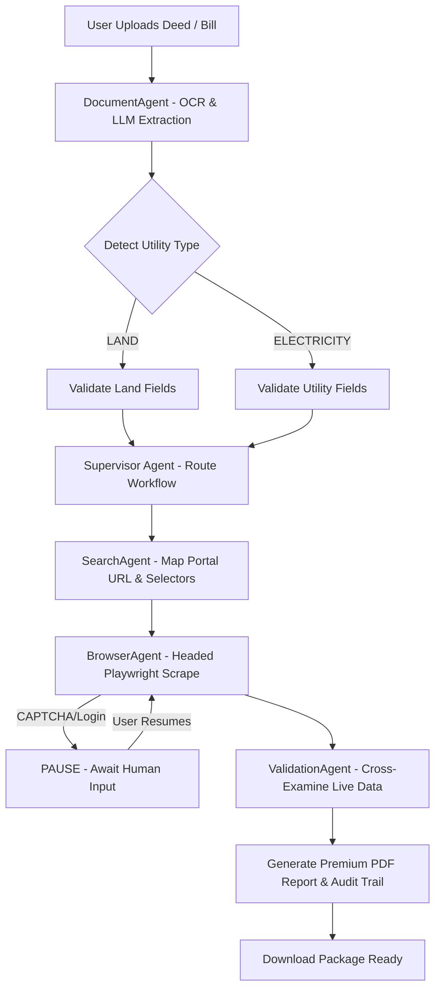

# 🌐 Dom-New: Autonomous Property & Utility Verification Platform

[](https://www.python.org/)
[](https://playwright.dev/)
[](https://flask.palletsprojects.com/)
[](#)

An advanced AI-powered agentic platform designed to verify land ownership documents and utility bills automatically. It uses **Playwright browser automation**, **Multimodal OCR (Gemini / Mistral)**, and **Human-in-the-Loop CAPTCHA resolution** to cross-examine uploaded deeds and bills against live government portals, generating a premium verification package including PDF reports and audit trails.

---

## 🛠️ Tech Stack & Key Technologies

- **Frontend**: Premium dashboard built using HTML5, modern HSL Vanilla CSS, and dynamic Javascript (fetch API).
- **Backend Server**: Flask (Python) with SQLAlchemy (SQLite) for task queue state, logger, and session control.
- **Agent Orchestration**: **Supervisor Agent** executing multi-agent planning & verification workflows.
- **Web Automation**: Playwright (Headed Browser Control) with custom dynamic selector normalization.
- **AI Core**: Multi-modal OCR parsing with Gemini Flash API, falling back to local Mistral (`mistral-small:24b` via Ollama) and structural layout parsers.

---

## 💎 Features

- **Multi-State Land Verification**: Cross-references deeds against land portals of **Uttar Pradesh (Bhulekh)**, **Bihar (Bihar Bhumi)**, and **West Bengal (Banglarbhumi)**.
- **Utility Bill Integration**: Automatically parses and verifies **West Bengal Electricity (WBSEDCL)** customer bills.
- **Smart Form Auto-Filling**: Autonomous agent navigates portals, selects dropdowns (District, Tehsil, Mouza/Village), and enters numbers (Khata, Plot, Consumer ID, Installation ID).
- **Human-in-the-Loop Captcha**: Pauses workflow and prompts the user on the dashboard when a Captcha appears. Automatically auto-clicks "Verify" and resumes once the user solves it.
- **Language Detection & Translation**: Checks for script mismatches (e.g. portal expects Hindi but deed is in English) and transliterates parameters automatically.
- **Audit Trails & Premium PDF**: Downloads live records, generates a stylized comparison layout, and packages it into a print-ready PDF report along with task action logs.

---

## 📐 Project Architecture



---

## 🚀 Setup & Installation

### 1. Clone the Repository
```bash
git clone https://github.com/your-username/dom-new.git
cd dom-new
```

### 2. Configure Virtual Environment
```bash
python -m venv venv
venv\Scripts\activate
```

### 3. Install Dependencies
```bash
pip install -r requirements.txt
playwright install chromium
```

### 4. Setup Environment Variables
Create a `.env` file in the root directory:
```env
# AI APIs
GEMINI_API_KEY=your_gemini_api_key_here
MISTRAL_API_KEY=your_mistral_api_key_here

# Local LLM Fallback (Ollama)
ACTIVE_LLM=gemini
MISTRAL_LOCAL_URL=http://localhost:11434
MISTRAL_LOCAL_MODEL=mistral-small:24b
```

### 5. Start the Application
```bash
py app.py
```
Visit `http://127.0.0.1:5000` in your web browser.

---

## 📁 Directory Structure

```text
├── agents/             # AI Agents (Supervisor, Document, Validation, Search, Browser)
├── browser/            # Playwright automation driver, DOM & accessibility readers
├── controllers/        # Flask HTTP routes & controllers
├── models/             # SQLite DB models (Task, DocumentRecord, AgentLog)
├── repositories/       # Database query abstraction handlers
├── services/           # PDF service, OCR parser, and core task controller
├── templates/          # Frontend HTML/CSS templates
├── storage/            # Task outputs, logs, screenshots, and PDF reports
├── app.py              # Application main runner entry point
└── requirements.txt    # Python dependencies
```

---

## 📝 License
Distributed under the MIT License. See `LICENSE` for more information.
